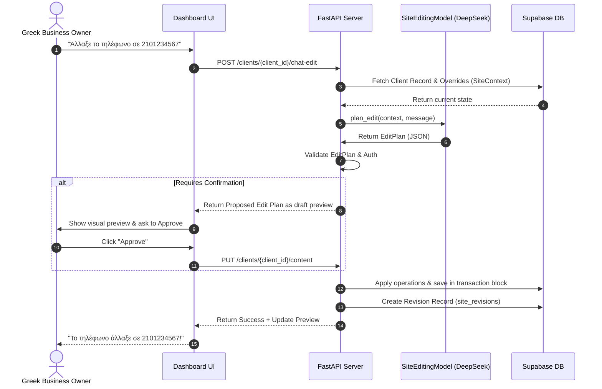

# Architecture of the Conversational Editing System

This document outlines the design, component interactions, and state flows for the conversational website editor.

## 1. System Overview

The conversational editor is designed on the principle of **Intent Planning vs. Deterministic Mutation**. The LLM acts as an offline planner that produces structured commands; it has no direct database or code execution rights. The core backend executes these commands within a transactional framework.



## 2. Component Design

### 2.1 Model Layer Interface (`src/ai_editor/model.py`)
Abstracts the LLM API call.
- Interface:
  ```python
  class SiteEditingModel(abc.ABC):
      @abc.abstractmethod
      def plan_edit(self, context: dict, message: str) -> EditPlan:
          pass
  ```
- Implementation: `DeepSeekSiteEditingModel` utilizing DeepSeek API's structured JSON output mode (OpenAI-compatible `response_format` with JSON schema).

### 2.2 Transaction & Validation Engine (`src/ai_editor/engine.py`)
Processes the operations sequentially.
- **Validation**: Ensures parameters fit criteria (e.g. phone has only allowed characters, palette is within range).
- **Rollback**: If any operation in the sequence fails, the entire transaction rolls back, leaving no partial state.
- **Auto-Apply vs. Confirmation Policy**:
  - **Auto-Apply**: `update_phone`, `update_hours`, `update_service` (addition/update), `set_palette`, `update_business_field` (text only).
  - **Confirmation Required**: `select_theme` (if templates differ significantly), `remove_service` (destructive).

### 2.3 Revisions and Undo Manager (`src/ai_editor/revisions.py`)
Tracks history and handles undos.
- **Table schema**:
  - `site_revisions`: Tracks UUID, client_id, timestamp, source, original message, operations list, before state, and after state.
- **Undo Flow**:
  - User says: `"Αναίρεσε την τελευταία αλλαγή"` (or clicks Undo).
  - Backend retrieves the most recent revision record from `site_revisions`.
  - Backend updates `site_content` directly with the `before_state` stored in that revision.
  - No LLM intervention is needed to reconstruct the old state.
