# Vitrina — 10-Site Real-World Sellability Benchmark

**Ημερομηνία:** 2026-08-13 · **Baseline:** `d5610ee` · **Πρώτη γενιά, καμία επανάληψη.**
Παραγωγή μέσω του πραγματικού pipeline (`qs.parse` → `enrich_with_copy` με
`claude-haiku-4-5` → `recommend_templates` → `normalize` → Next `/site/[client]`).
Το μόνο που αντικαταστάθηκε είναι η Supabase — καμία λογική παραγωγής.

---

## Executive summary

**Όχι. Στη σημερινή κατάσταση δεν μπορούμε να πουλήσουμε αυτά τα sites.**

Μηδέν από τα 10 βγήκαν SELLABLE. Μέσος όρος **44.4/70**, διάμεσος **47/70**.
**7 στα 10 έχουν hard fail** — και το χειρότερο δεν είναι αισθητικό:

- **5 sites ισχυρίζονται πράγματα που δεν είπε ποτέ ο πελάτης.** «Από το '90
  δουλεύουμε στο Περιστέρι», «15+ χρόνια στην Καλαμαριά», «για 30 χρόνια εδώ»,
  «Τρεις δεκαετίες», «θα κοστίσει 80 ευρώ». Κανένα δεν υπάρχει στο intake.
- **Δύο themes εκτυπώνουν ψεύτικη εμπιστοσύνη hardcoded**, ανεξάρτητα από πελάτη:
  `Motor` → «✓ Γραπτή εγγύηση», `Forge` → «Εγγύηση σε κάθε εργασία»,
  `CafeCollection` → «**Depuis 2026**» (κυριολεκτικά «από το 2026»).
- **Δύο sites δείχνουν λάθος επάγγελμα.** Ο υδραυλικός πήρε φωτογραφία **μηχανής
  αυτοκινήτου** και theme συνεργείου· το pet grooming πήρε φωτογραφίες
  **ανθρώπινου μανικιούρ** σε ενότητα «Ο χώρος μας».

Το τεχνικό επίπεδο είναι πραγματικά καλό: μηδέν overflow, μηδέν σπασμένη εικόνα,
μηδέν console error, ένα `h1` παντού, όλα τα guards πράσινα. **Αυτό ακριβώς είναι
το εύρημα:** το QA μετράει ό,τι ξέρει να μετρήσει, και τα σοβαρά προβλήματα
περνούν από δίπλα του χωρίς να τα δει κανείς.

---

## Results table

| # | Επιχείρηση | Vertical | Theme | Media | Vis | Mob | Cont | Spec | Fit | Trust | Tech | **Total** | Κατάταξη | Human |
|---|---|---|---|---|---|---|---|---|---|---|---|---|---|---|
| 1 | Υδραυλικά Βεργίνα | garage ❌ | motor | no-photo | 5 | 6 | 3 | 4 | 2 | 2 | 8 | **30** | REJECT | NO |
| 2 | Ηλεκτρολογείο Καρράς | trade | callout | 1 φωτο | 8 | 6 | 6 | 7 | 9 | 3 | 9 | **48** | MAJOR (hard fail) | NO |
| 3 | Γεωργία Στεφανίδου | professional | marble | no-photo | 8 | 8 | 7 | 7 | 8 | 6 | 9 | **53** | MINOR | BORDERLINE |
| 4 | Νίκη Αρβανίτη | doctor | clinic-triage | 1 φωτο | 5 | 6 | 7 | 6 | 7 | 6 | 9 | **46** | MAJOR | NO |
| 5 | Κομμωτήριο Ελένη | beauty | beauty-atelier | 4 φωτο | 9 | 7 | 8 | 8 | 9 | 7 | 9 | **57** | MINOR | BORDERLINE |
| 6 | Φούρνος Το Ζυμάρι | bakery | bakery-editorial | 4 φωτο | 8 | 6 | 4 | 5 | 4 | 3 | 8 | **38** | REJECT | NO |
| 7 | Ταβέρνα Ο Μπαρμπα-Λευτέρης | food | warmth | 4 φωτο | 8 | 8 | 6 | 7 | 9 | 3 | 9 | **50** | MAJOR (hard fail) | NO |
| 8 | Οδοντιατρείο Παπαδάκη | dentist | clinic-triage | no-photo | 6 | 6 | 7 | 6 | 8 | 3 | 9 | **45** | MAJOR | NO |
| 9 | Ακίνητα Δουκάκης | professional | marble | 3 φωτο | 8 | 8 | 6 | 7 | 8 | 3 | 9 | **49** | MAJOR (hard fail) | NO |
| 10 | Pet Spa Λούνα | massage ❌ | living | no-photo | 4 | 4 | 5 | 4 | 1 | 2 | 8 | **28** | REJECT | NO |

**SELLABLE 0 · MINOR 2 · MAJOR 5 · REJECT 3** (το #7 πέφτει από MINOR σε MAJOR
λόγω hard fail). Screenshots (desktop + mobile, 1440/390): [`shots/`](shots/). Τα πρωτότυπα PNG μένουν στο αγνοημένο `sites/artifacts/benchmark/shots/`.

---

## Per-site review

### 1. Υδραυλικά Βεργίνα — REJECT
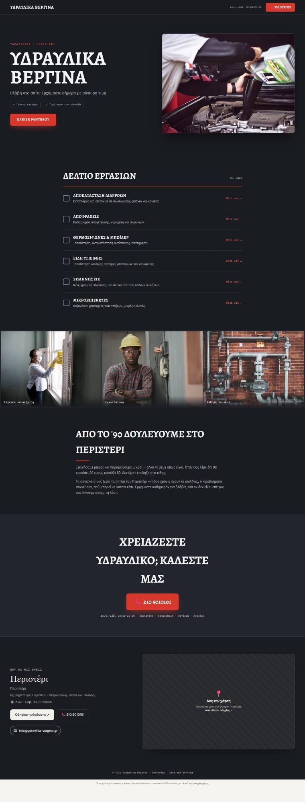
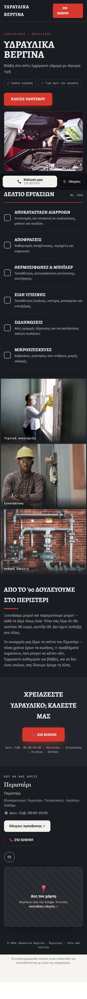

**Hard fails:** (α) hero = **μηχανή αυτοκινήτου**· (β) «**Από το '90** δουλεύουμε
στο Περιστέρι» — εφευρεμένο έτος ίδρυσης· (γ) «θα κοστίσει **80 ευρώ**» —
εφευρεμένη τιμή· (δ) «✓ **Γραπτή εγγύηση**» hardcoded στο theme.
**Αιτία:** η λέξη «**συνεργείο**» στην περιγραφή («μικρό συνεργείο υδραυλικών»)
ταιριάζει στον κανόνα `garage` πριν φτάσει στο `trade` → theme `motor` + garage
hero. Στα ελληνικά «συνεργείο» σημαίνει και «συνεργείο αυτοκινήτων» και «μπριγάδα».
**Ελληνικά:** «παραμείνουμε», «τα σωλήνες», «συχνεύουν», «Έρχομαστε», «του Περιστέρι».
**Κατηγορία:** A (generator/κανόνες vertical) + B (theme) + D (content).

### 2. Ηλεκτρολογείο Καρράς — MAJOR (hard fail)
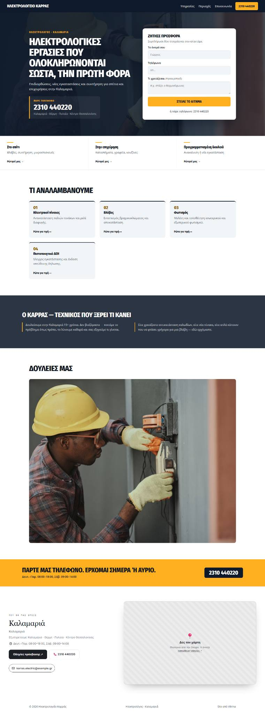
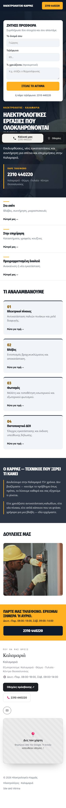
Το **καλύτερο vertical fit** του benchmark: quote card στο hero, τρία σενάρια
πελάτη, αριθμημένες υπηρεσίες, τεράστιο τηλέφωνο, κίτρινη ζώνη κλήσης.
**Hard fail:** «δουλεύουμε στην Καλαμαριά **15+ χρόνια**».
**Mobile:** η φόρμα προσφοράς μπαίνει **πάνω από τον τίτλο** — ο επισκέπτης
βλέπει φόρμα πριν μάθει ποιος είναι. **Μία φωτογραφία → γιγάντιο μπλοκ** 1200px.
**Κατηγορία:** D (content) + B (mobile σειρά).

### 3. Γεωργία Στεφανίδου — MINOR
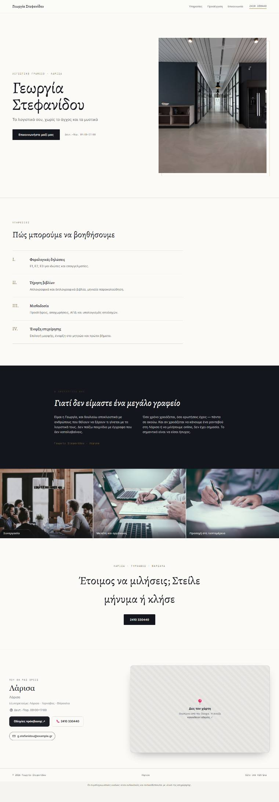
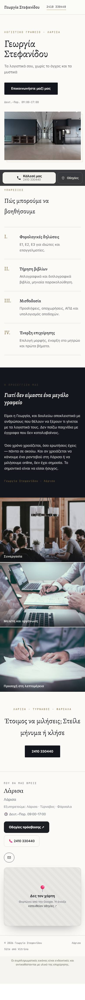
Ήρεμο, αξιόπιστο, σωστό για λογίστρια. «Γιατί δεν είμαστε ένα μεγάλο γραφείο» —
καλό, ειδικό κείμενο. **Αδυναμίες:** τρεις stock φωτογραφίες με **ομάδες
ανθρώπων** σε site ενός ατόμου· ανάμειξη ενικού/πληθυντικού («δεν είμαστε» vs
«Είμαι η Γεωργία»)· «όσο ερωτήσεις» (→ όσες)· CTA «Έτοιμος να μιλήσεις».
Το `signature` ήταν #2 και θα ταίριαζε καλύτερα. **Κατηγορία:** E + D + C.

### 4. Νίκη Αρβανίτη — MAJOR
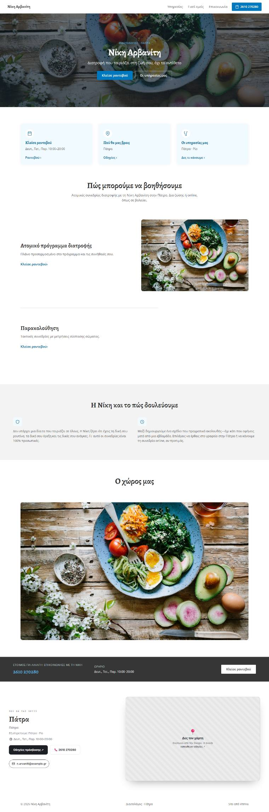
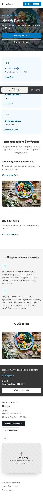
**Η ίδια φωτογραφία τρεις φορές** (hero, υπηρεσία, «Ο χώρος μας»). Με **2
υπηρεσίες** το εναλλασσόμενο layout αφήνει τεράστιο κενό. «Ο χώρος μας» τιτλοφορεί
πιάτο φαγητού. **Κατηγορία:** E (media) + B (theme σε λίγα δεδομένα).

### 5. Κομμωτήριο Ελένη — MINOR
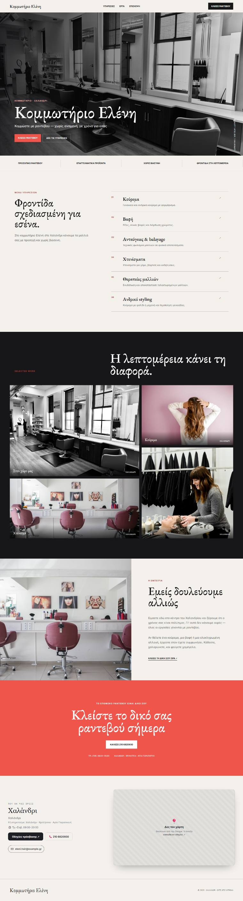
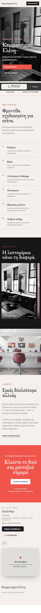
**Το πιο πωλήσιμο του benchmark.** Editorial hero, καθαρό ευρετήριο υπηρεσιών,
σωστή χρήση 4 φωτογραφιών, coral CTA. **Αδυναμίες:** το mobile gallery χάνει τις
μισές φωτογραφίες· η λωρίδα «Επαγγελματικά προϊόντα» είναι hardcoded default.

### 6. Φούρνος Το Ζυμάρι — REJECT
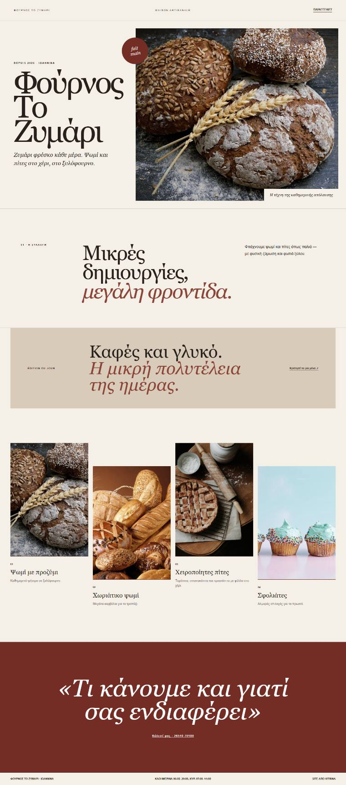
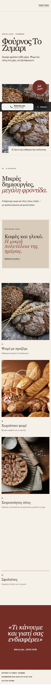
Όμορφο — και λάθος. **«DEPUIS 2026»**, «Maison artisanale», «fait main»,
«Édition du jour» hardcoded **γαλλικά** σε φούρνο των Ιωαννίνων. Το «Depuis 2026»
διαβάζεται ως έτος ίδρυσης, και είναι το **τρέχον έτος**. Ο τίτλος «**Τι κάνουμε
και γιατί σας ενδιαφέρει**» σε εισαγωγικά μοιάζει με ασυμπλήρωτο placeholder.
**9 υπηρεσίες → 4 ορατές** (cap 6 στο `normalize`, 4 στο theme). Στο mobile η 4η
κάρτα εμφανίζεται **χωρίς εικόνα**. Δεν υπάρχει χάρτης/διεύθυνση.
**Κατηγορία:** B (theme) + G (cap υπηρεσιών).

### 7. Ταβέρνα Ο Μπαρμπα-Λευτέρης — MAJOR (hard fail)
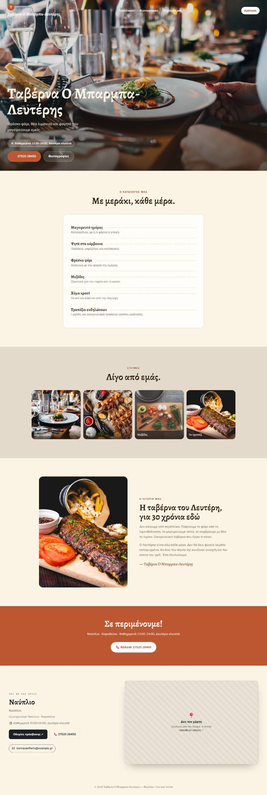
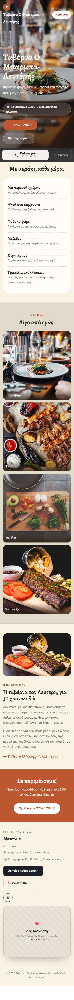
Ζεστό, σωστό vertical, πλήρης δομή. **Hard fail:** «για **30 χρόνια** εδώ».
Επίσης «το ψάρι από τη **λιμνοθάλασσα**» — το Ναύπλιο δεν έχει. Το eyebrow πάνω
από τον τίτλο είναι πρακτικά αόρατο πάνω στη φωτογραφία.

### 8. Οδοντιατρείο Παπαδάκη — MAJOR
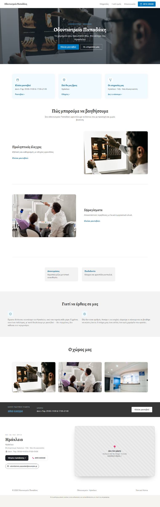
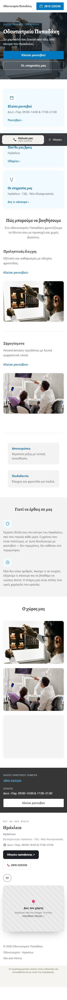
**Hard fail (ταυτότητα):** ενότητα «**Ο χώρος μας**» με stock φωτογραφίες ξένου
ιατρείου **και ανθρώπων** — παρουσιάζονται ως ο χώρος τους. Το disclosure είναι
γκρι 10px στο τέλος της σελίδας. Οι 2 τελευταίες υπηρεσίες γίνονται μικρά γκρι
κουτάκια δίπλα σε δύο μεγάλα panels — ασύμμετρη μεταχείριση.

### 9. Ακίνητα Δουκάκης — MAJOR (hard fail)
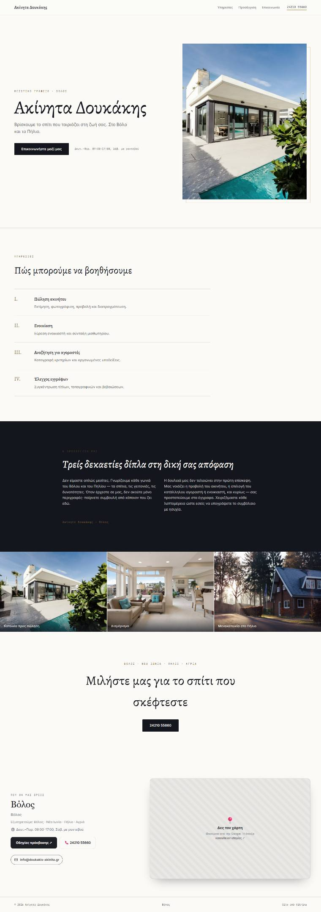
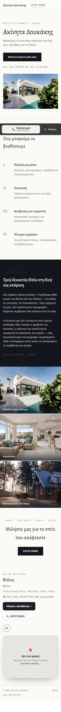
Καθαρό και σοβαρό. **Hard fail:** «**Τρεις δεκαετίες** δίπλα στη δική σας
απόφαση». Ίδιο theme (`marble`) και σχεδόν ίδια δομή με το #3 — δύο πολύ
διαφορετικές επιχειρήσεις μοιάζουν μεταξύ τους.

### 10. Pet Spa Λούνα — REJECT
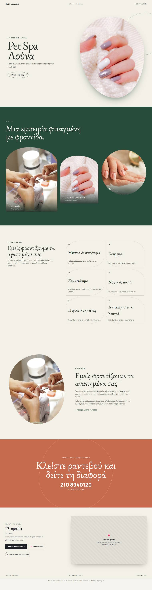
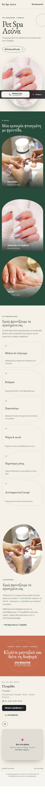
**Ολόκληρο το site εικονογραφείται με ανθρώπινο μανικιούρ**: hero = χέρι με
βαμμένα νύχια, gallery = «Μανικιούρ», «Χρώμα και λεπτομέρεια», «nail art» — για
κομμωτήριο **σκύλων και γατών**, κάτω από τον τίτλο «Ο ΧΩΡΟΣ». Ο ίδιος τίτλος
(«Εμείς φροντίζουμε τα αγαπημένα σας») εμφανίζεται **δύο φορές**. Το «Spa» στην
επωνυμία οδήγησε σε vertical `massage`.

---

## Systemic findings — top 10 κατά επίπτωση

| # | Εύρημα | Κατ. | Sites |
|---|---|---|---|
| 1 | **Το AI εφευρίσκει χρόνια λειτουργίας και τιμές.** Το `write_copy` δεν έχει φραγμό «μη γράψεις ό,τι δεν σου δόθηκε» για tenure/τιμή. | D | 1,2,7,9 |
| 2 | **Themes με hardcoded ψεύτικη εμπιστοσύνη**: «Γραπτή εγγύηση» (Motor), «Εγγύηση σε κάθε εργασία» (Forge), «Depuis 2026» (CafeCollection). Ισχύει για **κάθε** πελάτη τους. | B | 1,6 |
| 3 | **Λάθος vertical από μία λέξη.** «συνεργείο» → garage· «Spa» → massage. Οι κανόνες είναι substring-based χωρίς προτεραιότητα συμφραζομένων. | A/C | 1,10 |
| 4 | **Stock άνθρωποι παρουσιάζονται ως «ο χώρος μας»/«η ομάδα μας».** Το disclosure υπάρχει αλλά είναι αόρατο. | E | 3,8,10 |
| 5 | **Το `HERO_IS_REAL` δεν προστατεύει τίποτα στην πράξη**: το `normalize()` γεμίζει πάντα `HERO_IMAGE` με stock πριν φτάσει στο `withMediaFallback`, οπότε το flag βγαίνει `true` ακόμη και με μηδέν φωτογραφίες πελάτη. | E/G | όλα τα no-photo |
| 6 | **Μία φωτογραφία = επανάληψη ή γιγαντισμός.** Το ίδιο αρχείο 3 φορές (#4) ή ένα μπλοκ 1200px (#2). Κανένα theme δεν έχει στρατηγική για «ακριβώς 1». | B | 2,4 |
| 7 | **Οι υπηρεσίες κόβονται σιωπηλά στις 6** (`premium_generator.py:522`) και μετά το theme δείχνει ακόμη λιγότερες. 9 → 4 ορατές. | G | 6 |
| 8 | **Καμία παλέτα δεν επιλέγεται ποτέ** — και τα 10 βγήκαν `original`. Η δυνατότητα 5 παλετών υπάρχει και δεν χρησιμοποιείται από το pipeline. | G | όλα |
| 9 | **Ελληνικά με λάθη σε 4 sites**: «παραμείνουμε», «τα σωλήνες», «συχνεύουν», «Έρχομαστε», «του Περιστέρι», «όσο ερωτήσεις», «Τρείς». | D | 1,3,9 |
| 10 | **Mobile σειρά ενοτήτων**: φόρμα πριν τον τίτλο (#2), gallery που χάνει φωτογραφίες (#5), κάρτα χωρίς εικόνα (#6). | B | 2,5,6 |

**Καμία κατηγορία δεν λύνεται με νέο theme.** Τα #1, #9 είναι content pipeline·
τα #2, #6, #10 είναι διορθώσεις σε υπάρχοντα themes· τα #3 είναι κανόνες·
τα #5, #7, #8 είναι data-model.

---

## Theme findings

**Επιλέχθηκαν 8 μοναδικά themes σε 10 sites** — καλή ποικιλία, αλλά `marble` και
`clinic-triage` από δύο φορές, και τα δύο ζευγάρια βγήκαν οπτικά συγγενικά.

- **Γενuinely strong:** `beauty-atelier` (57), `callout` (48 — το χαμηλό οφείλεται
  αποκλειστικά στο κείμενο), `warmth`, `marble`.
- **Αδύναμα εδώ:** `clinic-triage` με λίγα δεδομένα (2 υπηρεσίες → κενά panels),
  `living` για μη-άνθρωπο πελάτη, `motor` εκτός συνεργείου.
- **Λάθος mapping:** υδραυλικός → `motor`· pet grooming → `living` (μέσω `massage`).
- **Υποχρησιμοποιημένα:** το **`signature` βγήκε #2 τρεις φορές (3, 4, 10) και
  δεν επιλέχθηκε ποτέ** — η παραγωγή παίρνει πάντα `ranked[0]`. Το `dispatch` και
  το `longform` δεν εμφανίστηκαν σε κανένα από τα 10 vertical (αναμενόμενο).
- **Παλέτες:** δεν δοκιμάστηκαν από το προϊόν — τίποτα δεν τις ορίζει.

---

## Content findings

**Δουλεύει:** ο τόνος. Το «Γιατί δεν είμαστε ένα μεγάλο γραφείο», το «Ξεκινήσαμε
μικροί και παραμένουμε μικροί», το «Εδώ δεν είσαι αριθμός» ακούγονται ελληνικά
και όχι μεταφρασμένα. Οι υπηρεσίες του πελάτη περνούν αυτούσιες και σωστά.
Η δομή απαντά νωρίς στα σωστά ερωτήματα (τι, πού, πώς καλώ).

**Δεν δουλεύει:** ο ίδιος μηχανισμός που δίνει τον καλό τόνο εφευρίσκει και
γεγονότα. Το μοντέλο γεμίζει τα κενά αντί να τα αφήσει κενά — και τα κενά που
γεμίζει είναι ακριβώς αυτά που πουλάνε (χρόνια, τιμή, εγγύηση). Δεύτερο θέμα:
ορθογραφικά/συντακτικά λάθη σε 4 στα 10, που για πληρωμένο site είναι ορατά.

---

## No-photo findings

**Όχι ακόμη — και για διαφορετικό λόγο απ' ό,τι νομίζαμε.**

Τα 4 no-photo sites (1, 3, 8, 10) **δεν φαίνονται άδεια**. Το πρόβλημα είναι το
αντίθετο: γεμίζουν με stock εικόνες που **δηλώνουν ταυτότητα** — «ο χώρος μας»,
«η ομάδα μας», «η δουλειά μας». Το `signature`, το μόνο theme σχεδιασμένο για
τίμιο no-photo (μονόγραμμα + κάρτα αληθινών στοιχείων), **δεν επιλέχθηκε ποτέ**.

Δηλαδή: έχουμε τη λύση, δεν τη σερβίρουμε.

---

## Recommendation

### C. NOT READY — SYSTEMIC QUALITY WORK REQUIRED

Όχι επειδή τα sites είναι άσχημα — αρκετά είναι όμορφα. Επειδή **7 στα 10 λένε
ψέματα**, και τα ψέματα είναι του είδους που δημιουργεί έκθεση: εφευρεμένα χρόνια
λειτουργίας, εφευρεμένη τιμή, εφευρεμένη εγγύηση, ξένος χώρος ως «ο χώρος μας».
Ένας πελάτης που το προσέξει δεν ζητά διόρθωση — φεύγει. Ένας που δεν το προσέξει
δημοσιεύει ισχυρισμό που δεν ισχύει.

Το ενθαρρυντικό: **κανένα από τα τρία κύρια προβλήματα δεν είναι σχεδιαστικό.**
Το design engine αποδεικνύεται ικανό (57 και 53 χωρίς hard fail). Τα εμπόδια είναι
ένα φίλτρο αλήθειας στο copy, τρεις hardcoded συμβολοσειρές, και δύο κανόνες
ταξινόμησης. Δεν χρειάζεται ούτε νέο theme ούτε Structural Spine.

**Ρεαλιστικό ταβάνι σήμερα:** ~57/70 στην καλύτερη περίπτωση (κομμωτήριο με καλές
φωτογραφίες). **Πραγματικό μέσο:** 44.4/70.

---

## Παράρτημα — τι έγινε και τι δεν έγινε

- **Πρώτη γενιά μετρήθηκε.** Καμία αναπαραγωγή για καλύτερο αποτέλεσμα, καμία
  χειροκίνητη διόρθωση κειμένου ή εικόνας, καμία επιλογή theme από εμένα.
- **Ένα benchmark-enabling fix:** το δικό μου harness κρεμούσε στο `img.decode()`
  αργής εικόνας δικτύου· προστέθηκε χρονικό όριο. Δεν άλλαξε κώδικας προϊόντος.
- **Technical QA:** spine/registry/profiles/verticals/editor guards, design guard,
  75 python tests, production build 22/22 — **όλα πράσινα**. Μηδέν overflow, μηδέν
  σπασμένη εικόνα, μηδέν console error, ένα `h1` ανά σελίδα, τηλέφωνο παντού.
- **DeepSeek:** δεν χρησιμοποιήθηκε. Δεν ανήκει στο generation path, 10 sites δεν
  είναι όγκος έρευνας, και η οπτική κρίση δεν ανατίθεται.
- **Δεν πειράχτηκε** τίποτα του Lead Scoring workstream ούτε το `STATUS.md`.
